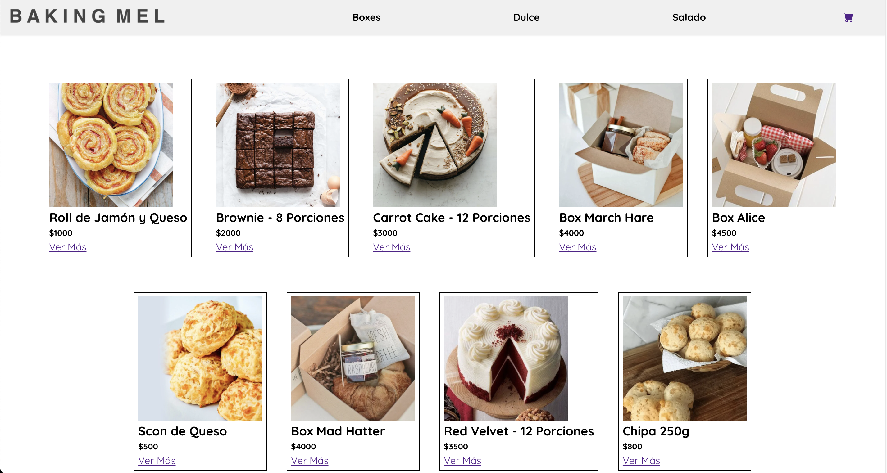
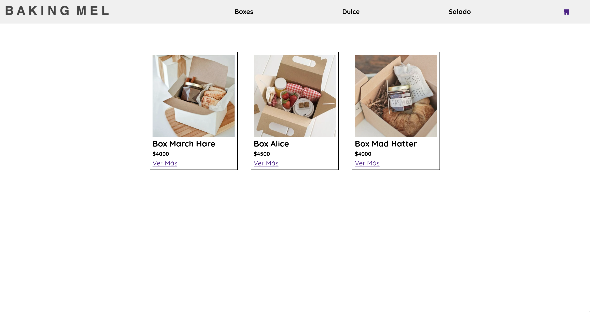
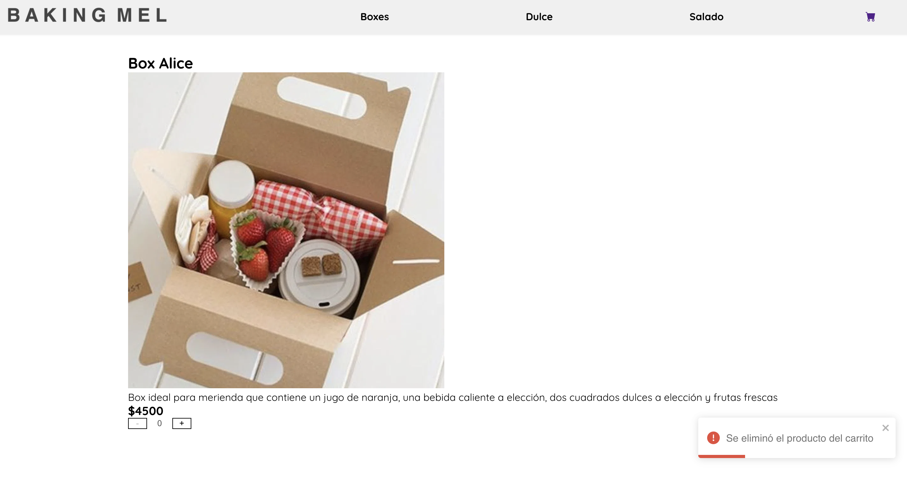
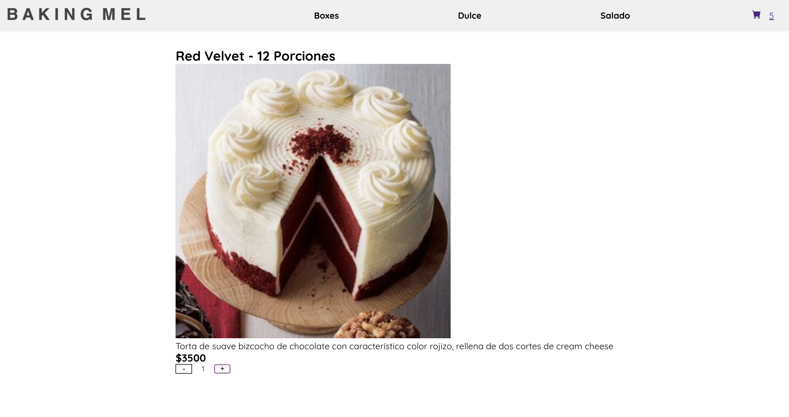
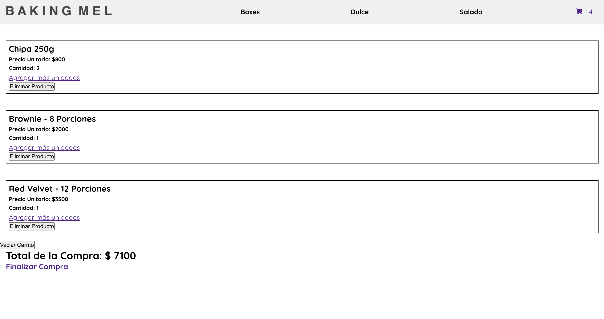
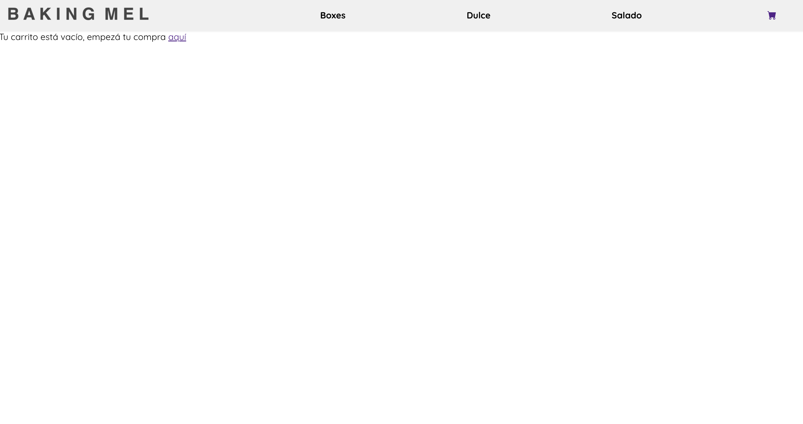
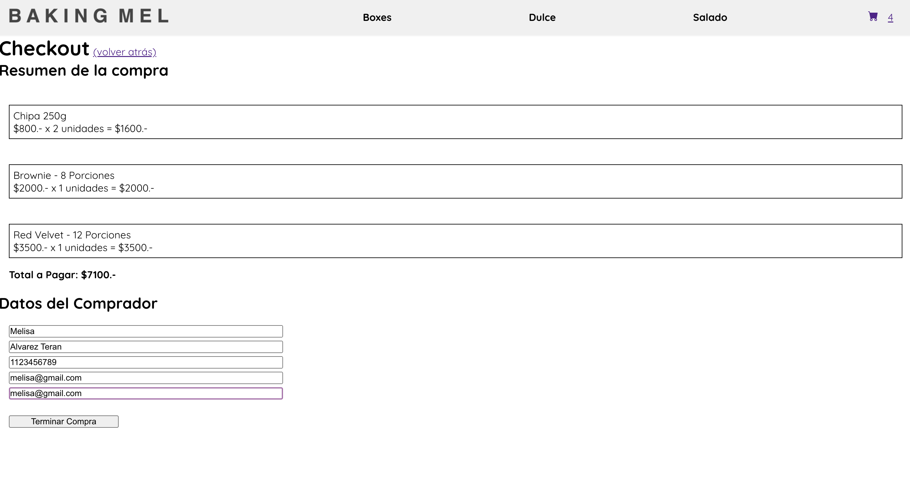
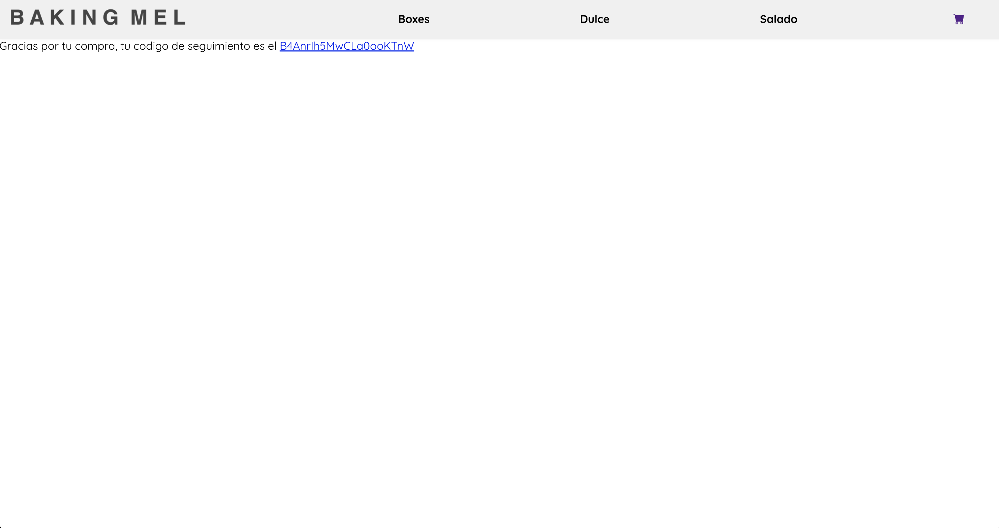
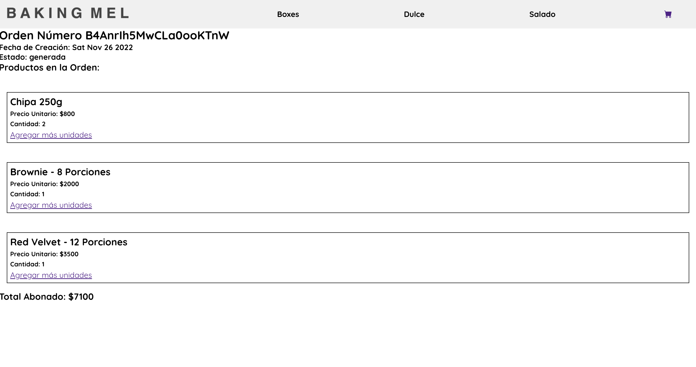

# Proyecto Final React JS - Ecommerce

## Resúmen del Proyecto

Mi nombre es Melisa Alvarez Terán, y este proyecto se enmarca dentro del curso de React JS de Coderhouse: Se trata de un sitio Ecommerce que comercializa productos para la hora del 
té.

Los productos se agregan desde la pantalla de detalle de los mismos, y desde allí se pueden además sumar unidades, restarlas o eliminar el ítem completamente. 

Los productos además pueden eliminarse de a uno desde el Cart, o vaciarse por completo. 

Gracias al uso del Context la cantidad de cada ítem se guarda en cualquier etapa de la app, permitiendo que el usuario agregue un producto, luego otro y vuelva al anterior conservando en el contador la cantidad que había agregado, y permitiendo que se siga sumando a esa misma cantidad. Este flujo también se conserva si se ingresa al Cart y se vuelve hacia el ítem, tanto para sumar como para restar cantidades.

## Componentes Generados
La app está compuesta por cuatro grupos de componentes:

- **Componentes Generales**

El `Navbar` muestra un menú de categorías. Clickeando sobre cada una se muestran en pantalla unicamente los productos que pertenecen a la misma.

- **Componentes de Producto**

Existen dos componentes "padres" de Productos, el `ItemDetailContainer` y el `ItemListContainer` ambos contienen una lógica similar, utilizando firebase para obtener los datos de los productos.

En el caso del `ItemListContainer` se muestra un conjunto de productos (renderizando un `ItemCard` por cada uno), en cambio el `ItemDetailContainer` muestra un producto en particular, con su descripción, foto y precio, y permite además añadirlo al carrito mediante otro componente llamado `ItemCount`.

Por último se agregó para garantizar una buena experiencia de usuario un componente `NotFound`, que muestra una página de "Producto no Encontrado" en caso de que el ID del producto buscado no coincida con ninguno existente en la base de FireStore.

- **Componentes de Carrito**

A nivel carrito de compras se encuentra el `CartWidget`, que permite al usuario verificar cuántos productos ha agregado al carrito hasta el momento, además, funciona como un enlace hacia el componente `Cart`, en donde se muestra el resumen de los productos agregados (renderizados mediante el `CartItem`, que muestra el nombre, cantidad y precio unitario de cada producto), y el total de la compra, junto con un enlace para continuar hacia el `Checkout`

- **Componentes de Checkout y Orden**

El último paso de la compra es el `Checkout`, en donde se muestra el resumen de la misma en conjunto con un formulario en donde el cliente ingresa sus datos (incluyendo una validación que pide dos veces el mail y verifica si es el mismo). Una vez completados los datos se habilita el botón de "Finalizar Compra", que guarda todos los datos anteriores en una colección de FireStore especialmente para ello, y muestra el ID de la misma al finalizar, con un enlace hacia el `OrderPlaced`, que muestra el detalle de la compra recién realizada que puede visitarse en cualquier momento al acceder a la ruta proporcionada.
  
## Librerías Utilizadas

- *react-router-dom*:
Librería utilizada para crear rutas y mostrar diferente contenido dependiendo de los URL Params. Puntualmente se utiliza para mostrar cada categoría, el detalle de cada producto, el Cart, Checkout y OrderPlaced.

- *firebase*:
Se utiliza Firebase para almacenar en Firestore los datos de los productos que se consultan en los componentes de Producto, y las ordenes una vez creadas, que luego también se consultan para mostrar su detalle al cliente.

- *react-toastify*:
Se agregó esta librería para brindar al cliente una notificación al momento de agregar o sumar un ítem al carrito, y al momento de sumar o restar unidades. Siempre desde la pantalla de detalle del producto solamente, ya que es desde donde no se ve el carrito completo en ningún momento y es una forma de darle feedback al usuario de que su click (en sumar o restar) surtió el efecto buscado.

## _Flujo de Compra_

Al ingresar los usuarios ven un listado completo de los productos disponibles y sus valores.

Pueden elegir un producto directo desde la Home o seleccionar una categoría, lo que permite filtrar los productos por ese parámetro:

Al ingresar a "Ver Más" dentro del resumen del producto, se accede al detalle del mismo, en donde se muestra la foto, una descripción, el precio y un contador para agregar el producto al carrito

Por cada click en el botón "+" el cliente agrega una unidad de ese ítem al carrito, mientras que por cada click en "-" descuenta una unidad. En cada una de estas acciones se recibe un mensaje mediante un "toast", que indica si se sumó o restó el ítem

Si el producto no existía en el carrito, el mensaje es "Se añadió el producto del carrito", mientras que si se está sumando una nueva unidad del mismo ítem, el mensaje será "Se sumó una unidad del carrito".

Al mismo tiempo, si se resta una unidad el mensaje es "Se eliminó una unidad del carrito", pero si se alcanza la cantidad 0 el producto se elimina del carrito, y se recibe un mensaje de "Se eliminó el producto del carrito".

Todas estas acciones modifican el contador dentro del CartWidget, que muestra junto al ícono del Carrito la cantidad total de ítems en el mismo.

Para ver el resúmen de su compra el cliente deberá acceder al carrito haciendo click en el ícono, viendo el resumen de los ítems con su cantidad y precio unitario, y el total de la compra. Además se incluye por cada ítem un botón para eliminarlo del carrito.

También se puede, desde esta pantalla, continuar hacia el Checkout o eliminar la totalidad de los ítems.

Si el carrito no contiene ítems, se muestra un mensaje de "Carrito Vacío" con un link a la home, invitando al cliente a añadir productos al mismo.

Cuando el cliente selecciona "Finalizar Compra" se muestra el resumen de la compra, con el nombre de cada producto, su cantidad y precios y el subtotal por cada producto. El total a pagar. Y un formulario para ingresar los datos del cliente. Una vez que se ingresen los datos (incluido el mail por duplicado), se habilita el botón de "Terminar Compra"

Clickeando en dicho botón la compra se almacena en Firestore y el carrito actual se vacía, y el cliente recibe un mensaje de éxito con un enlace hacia su orden.

Este enlace es accesible en cualquier momento y contiene todo el detalle de la compra, el horario en q fue generada y su estado.

